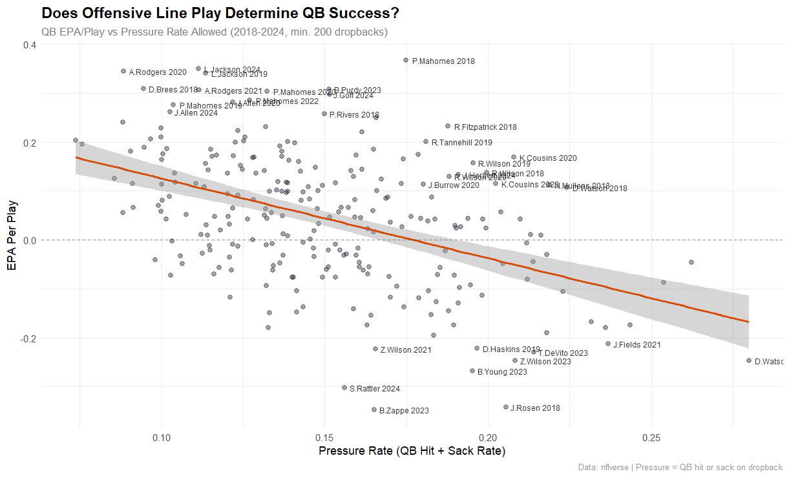
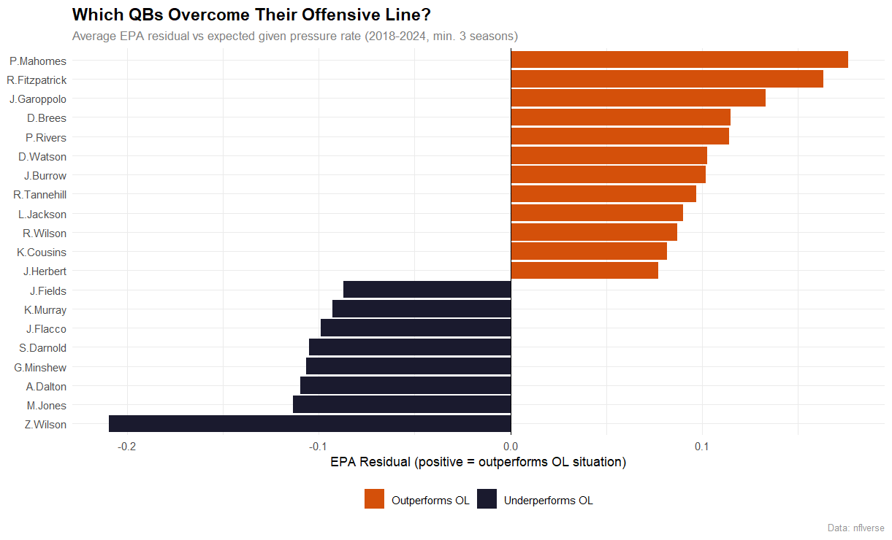
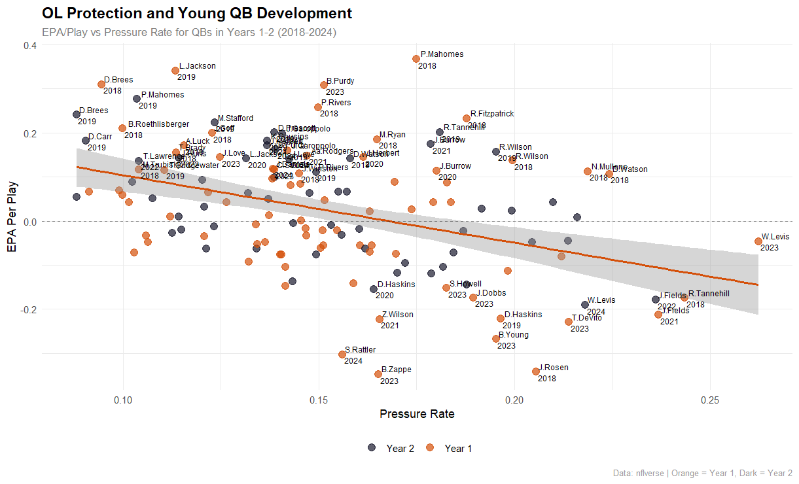

# Offensive Line Protection and QB Performance: Does Your OL Determine Your QB's Success?

*A multi-season analysis of NFL pressure rates, QB efficiency, and young quarterback development (2018-2024)*

---

## Overview

The conventional wisdom in football is simple: put a great QB behind a bad offensive line and it does not matter how good he is. But how true is that really? And which quarterbacks consistently beat their situation — and which ones cannot?

This project uses NFL play-by-play data from 2018-2024 to quantify the relationship between offensive line pressure rate and QB EPA per play, identify which QBs consistently outperform or underperform their protection, and examine whether young QBs are more vulnerable to poor OL play than veterans.

---

## Hypothesis

Pressure rate allowed by the offensive line will negatively correlate with QB EPA per play. Elite QBs will show positive residuals — producing above what their protection situation predicts — while below-average QBs will show negative residuals. Young QBs in their first two seasons will be more sensitive to pressure than veterans.

---

## Data Source

- **nflverse play-by-play data (2018-2024)** via the `nflreadr` package in R
- Filtered to regular season passing plays only
- Minimum 200 dropbacks per season to ensure meaningful sample sizes
- Minimum 3 seasons for career residual analysis

---

## Methodology

### OL Pressure Metric
Pressure rate is calculated as the proportion of dropbacks resulting in either a QB hit or a sack. This is an imperfect proxy for true pressure rate — it does not capture hurries or incomplete pressures — but it is the most reliable measure available in public play-by-play data.

### QB Performance Metric
EPA per play (qb_epa from nflverse) measures the value added or lost on each dropback relative to expectation. It is the most context-neutral measure of QB efficiency available in public data.

### Residual Analysis
A simple linear regression of EPA per play on pressure rate was fit across all qualifying QB seasons. Each season's residual represents how much a QB over or underperformed given their OL situation. Career average residuals identify which QBs consistently beat or lose to their protection.

---

## Findings

### 1. Pressure Rate and QB Performance Are Meaningfully Correlated

| Metric | Value |
|--------|-------|
| Pearson r | -0.453 |
| r² | 0.205 |
| p-value | 4.53e-14 |
| Sample | 250 QB seasons |

Pressure rate explains about 20% of variance in QB EPA per play — a meaningful but incomplete relationship. The other 80% comes from factors the OL does not control: QB talent, scheme, receivers, and game situation.

### 2. Some QBs Consistently Overcome Their OL Situation

| Rank | QB | Avg Residual | Avg Pressure Rate | Avg EPA |
|------|----|-------------|-------------------|---------|
| 1 | P.Mahomes | +0.176 | 14.2% | 0.233 |
| 2 | R.Fitzpatrick | +0.163 | 18.6% | 0.149 |
| 3 | J.Garoppolo | +0.133 | 13.8% | 0.196 |
| 4 | D.Brees | +0.115 | 9.98% | 0.241 |
| 5 | J.Burrow | +0.102 | 16.5% | 0.121 |

Mahomes leads by a wide margin across 7 seasons — the clearest evidence in this dataset that a single QB can consistently transcend his protection situation. Tannehill (8th, +0.097) behind a 20.7% pressure rate is one of the most underrated findings here.

### 3. Some QBs Consistently Underperform Their Protection

| Rank | QB | Avg Residual | Avg Pressure Rate |
|------|----|-------------|-------------------|
| Last | Z.Wilson | -0.199 | 16.1% |
| 2nd Last | M.Jones | -0.127 | 15.4% |
| 3rd Last | A.Dalton | -0.109 | 11.2% |

Zach Wilson is the most dramatic underperformer — negative EPA even accounting for his pressure rate. Andy Dalton underperforming behind a relatively clean pocket (11.2% pressure rate) is a notable finding.

### 4. Young QBs Are Not Meaningfully More Sensitive to Pressure

A key hypothesis was that young QBs in years 1-2 would show a stronger negative correlation between pressure rate and performance than veterans. The data does not support this.

| Group | Pearson r | p-value |
|-------|-----------|---------|
| All QB seasons | -0.453 | 4.53e-14 |
| Years 1-2 only | -0.403 | 9.44e-07 |
| Difference | +0.050 | — |

The 0.05 difference is not meaningful. Pressure hurts all QBs at roughly the same rate regardless of experience. The individual cases of Fields, Young, and Wilson in the bottom right of the young QB chart reflect compounding struggles — both under heavy pressure and performing below expectation — rather than a systemic vulnerability unique to young QBs.

### 5. The Caleb Williams Implication

Justin Fields appeared in the bottom right of the young QB development chart in both 2021 and 2022 — high pressure rate, negative EPA in consecutive seasons. The Bears OL situation was not incidental to his struggles. Whether those struggles were primarily OL-driven or QB-driven cannot be definitively answered here, but the pattern is consistent with an environment that gave a young QB very little room to develop.

Caleb Williams enters 2026 with an improved but still inconsistent offensive line. This analysis suggests the pressure he faces will affect his EPA in roughly the same way it affects any QB — there is no evidence young QBs are uniquely shielded from it. The margin for error is real.

---

## Visualizations

### Pressure Rate vs QB EPA Per Play (2018-2024)

### Which QBs Overcome Their Offensive Line?

### OL Protection and Young QB Development

---

## Limitations

- QB hit and sack rate is an imperfect pressure proxy — true pressure rate including hurries would strengthen the analysis
- EPA per play does not isolate QB contribution from receiver separation, scheme, or play calling
- Sample sizes for some QBs are small — Fitzpatrick and Garoppolo results should be interpreted cautiously
- 2018-2024 window may not fully capture career trends for QBs with longer careers

---

## Tools

R | tidyverse | nflreadr | ggplot2 | broom

---

*Part of an ongoing sports analytics portfolio. All data sourced from publicly available nflverse datasets.*